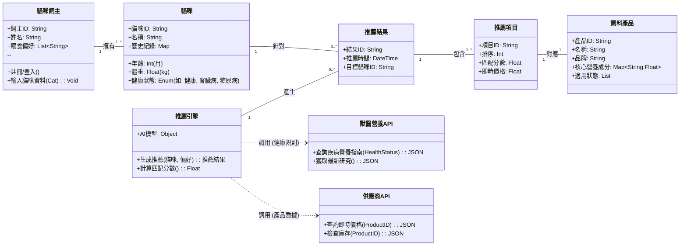
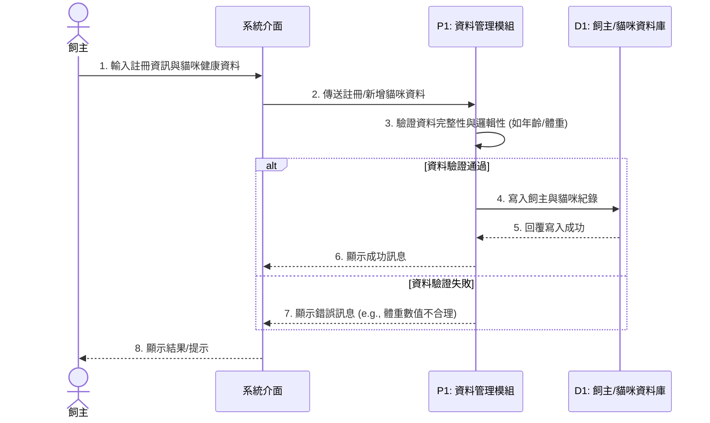
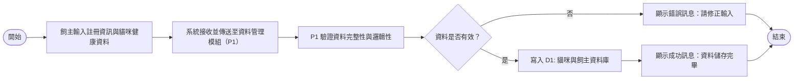
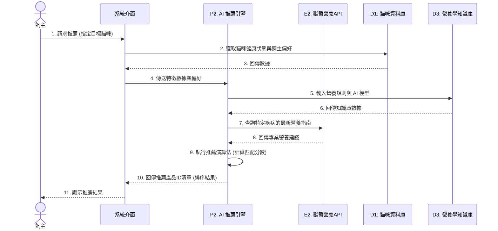
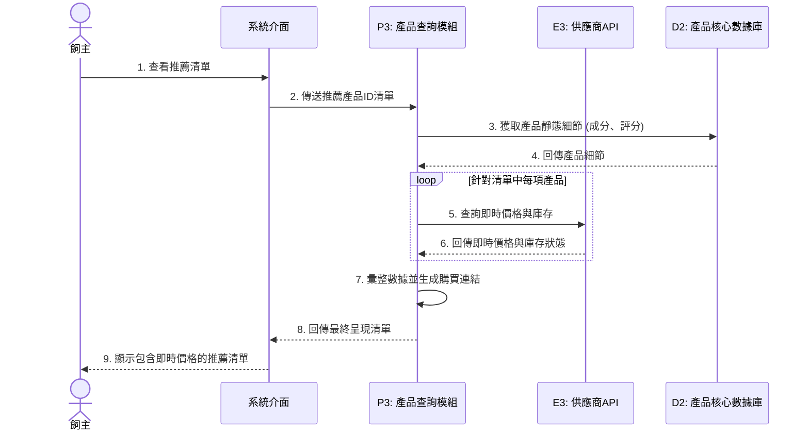
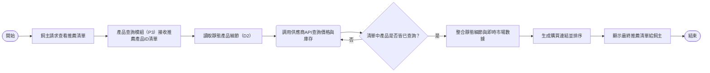

# UML類別圖

## 使用案例 使用者登入系統
### 循序圖

### 活動圖


## 使用案例 AI 推薦景點
### 循序圖

### 活動圖
```mermaid
flowchart LR
    A0([開始])
    A1[飼主請求飼料推薦]
    A2[讀取貓咪健康數據與飼主偏好（D1）]
    A3[載入營養學規則與知識庫（D3）]
    A4[調用獸醫API獲取最新指南]
    fork
      A5_1[將貓咪數據轉為AI特徵]
      A5_2[整合API與知識庫數據]
    end
    A6[執行AI推薦模型並計算匹配分數]
    A7[產生推薦產品ID清單並排序]
    A8[顯示推薦清單給飼主]
    A9([結束])

    A0 --> A1 --> A2 --> A3 --> A4
    A4 --> A6
    A6 --> A7 --> A8 --> A9

```
## 使用案例 動態更新路線建議
### 循序圖

### 活動圖

